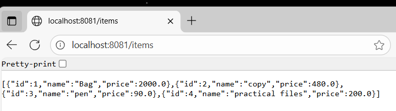

# Rest CRUD Project

This is a simple **Spring Boot CRUD application** with REST API.

# Features
- **POST /items** → Add new item
- **GET /items** → Fetch all items
- **PUT /items/{id}** → Update item
- **DELETE /items/{id}** → Delete item

# Tech Stack
- Java
- Spring Boot
- H2 Database
- Postman (for testing)

# Screenshot
[App Screenshot](Screenshot.png)

# How to Run
1. Clone the repo:-
   
   > git clone <repo-link>
   > cd rest-crud
   
2. Run the application:-

   > mvn spring-boot:run

3. Test APIs using Postman:-

   {
   "name": "Bag",
   "price": 2000,
   "quantity": 2
   }
## Screenshots

# 1. Get All Items
[Get Items]()

